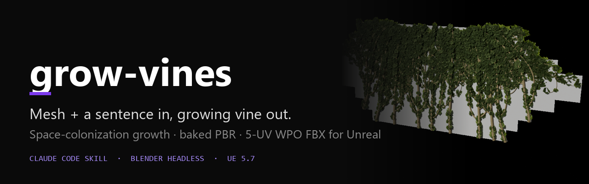
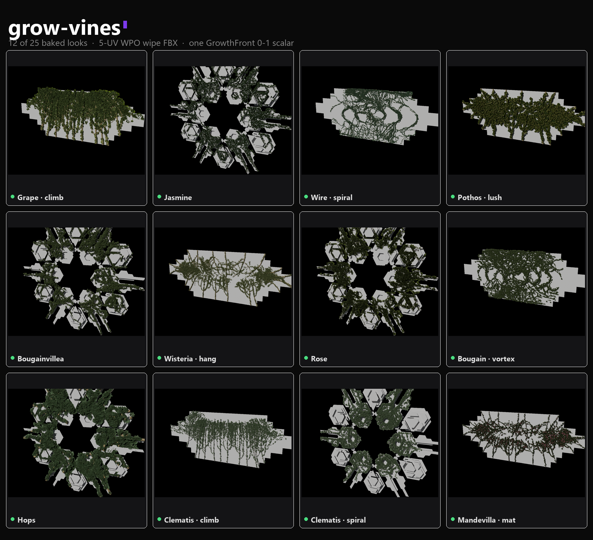

# grow-vines



[](LICENSE)
[](https://docs.anthropic.com/en/docs/claude-code)
[](https://www.blender.org/)
[](CONTRIBUTING.md)

**Mesh + a sentence in, growing vine out.** A Claude Code skill that grows a vine over any 3D mesh and plays it back in Unreal Engine from a single 0-1 material scalar — natural-language brief in, 5-UV static FBX plus baked PBR textures out.

## The Problem

Growing-foliage reveals — for installations, games, or cinematics — normally mean hand-animating growth, or hauling heavy alembic caches into the engine. Both are slow to iterate and expensive at runtime.

grow-vines bakes the entire growth animation into UV channels on a plain static mesh. In Unreal, one 0-1 scalar (`GrowthFront`) drives the whole reveal: grow, ungrow, scrub, and loop are all just how you move that one number.

## What This Does

- **Natural-language briefs as the control surface.** "Dense ivy mat creeping from outside", "bold climbers rising from the base", "a spiral vortex winding into the front" — the brief picks where the vine starts and how it spreads, plus density (sparse to lush), stem thickness (fine to bold), species, and flowers.
- **11 species keywords**: grape, ivy, jasmine, fig, wire, clematis, wisteria, honeysuckle, hops, rose, bougainvillea.
- **Any target mesh.** OBJ / FBX / glTF / GLB (multi-part assets are joined), or a primitive keyword (`sphere`, `cube`, `plane`). Growth parameters auto-fit to the target's bounding box, so any size works.
- **Space-colonization growth**, surface-constrained to the target mesh.
- **5-UV static FBX export** — `UVMap, wipe, dx, dy, dz` — that reveals and unfurls from a single `GrowthFront` 0-1 scalar. No skeleton, no cache, Nanite-friendly.
- **Baked bark + leaf PBR textures** per run.
- **Parameterized Unreal master materials** (`M_Vine_Leaf`, `M_Vine_Bark`, UE 5.7) with the WPO + opacity-reveal graph already wired.
- **Self-verifying, plus an independent check.** Every run reimports its own export to verify; a separate `verify_wpo_independent.py` script confirms the FBX without trusting the gate.
- **Works without any paid assets.** If the optional BagaIvy addon is absent, a procedural leaf-card generator synthesizes stylized leaf and flower cards per species.
- **Deterministic headless runs.** One isolated Blender per vine, `--factory-startup`, `PYTHONHASHSEED=0`. No live Blender or Unreal connection required for generation.



*12 of the 25 baked looks produced with the same build + export path.*

## Quick Start

One-line install:

```bash
curl -fsSL https://raw.githubusercontent.com/REMvisual/claude-grow-vines/main/install.sh | bash
```

Or manually:

```bash
git clone https://github.com/REMvisual/claude-grow-vines.git
cp -r claude-grow-vines/skills/grow-vines ~/.claude/skills/
python ~/.claude/skills/grow-vines/scripts/fetch_assets.py   # one-time bark PBR fetch (CC0)
```

**Prerequisites**: Blender 4.2+ (developed and verified on 5.1), Python 3 for the asset fetch, and Claude Code if you want the conversational route.

## Usage

In Claude Code, just ask:

> grow vines over this mesh: C:/models/pillar.fbx — bold ivy climbers rising from the base

Or run headless yourself (one isolated Blender per vine):

```
PYTHONHASHSEED=0 "<blender>" --background --factory-startup \
  --python "<skill>/scripts/grow_vine.py" -- <MESH> "<BRIEF>" <OUTDIR> [NAME]
```

### Brief to behaviour

| Say... | Result |
|---|---|
| "creeping mat **from outside**", "overgrown", "ground-cover" (default) | seeds beyond the silhouette, mats over the surface |
| "**from inside** / from the surface", "sprouting/erupting out of the mesh" | on-surface scatter seeds — vine emerges from the mesh |
| "**climbing** / vertical / rising from the base", "bold columns" | vertical climbers from the bottom edge |
| "**spiral / vortex / winding into** a point" | structured logarithmic-spiral swirl |

Also understood: density (`sparse` vs `dense/lush`), stem thickness (`fine/wire` vs `bold/thick`), species, and flowers (`flowering` vs `foliage only`).

### What a run produces

- `vine_<name>_wpo.fbx` — static mesh with 5 UV channels
- `tex/` — bark + leaf PBR maps
- `wpo_compliance.json` — verify record
- `README.md` — per-run deploy summary

## How It Works

- `scripts/intent_map.py` maps the free-text brief to a growth recipe (mode, density, thickness, species, flowers).
- `scripts/grow_vine.py` orchestrates: auto-fit to the target's bounds, build, bake the 5 UVs, export, reimport-verify, and write textures.
- Underneath sits the vendored `scripts/plantgen/` core: `skeleton` (space-colonization growth), `skin` (stem geometry), and `foliage` (leaf/flower cards, with `leaf_fallback` when BagaIvy is absent).
- Every vertex carries a growth coordinate `gt_point` in [0,1] (0 at root, 1 at tips), baked into the `wipe` UV channel. The material compares it against `GrowthFront` to reveal.
- `dx/dy/dz` UV channels store per-vertex unfurl deltas (`pivot - vertex`, pre-multiplied to centimetres) so World Position Offset can physically scale each vertex out from its stem as the front passes.
- Each scalar lives in the U component of its UV channel only — FBX flips V on import, so U-only storage is flip-proof.
- The same build + export path is proven across 25 baked looks.

## Example Output

See the `examples/` directory for a complete run walkthrough (`example-run.md`) and a real verify record (`example-wpo_compliance.json`).

## Unreal Deployment

Condensed from [unreal/IMPORT.md](skills/grow-vines/unreal/IMPORT.md):

1. Copy `unreal/Content/VineWPO/` (`M_Vine_Leaf`, `M_Vine_Bark`) into your project's `Content/`. Authored in UE 5.7 — re-save from your engine if the `.uasset`s won't load.
2. Import `vine_<name>_wpo.fbx` with **Offset Uniform Scale = 100** (UE 5.5+ Interchange) so it lands in centimetres matching the baked deltas. Enable **Nanite**; keep all 5 UV channels.
3. Import the run's `tex/*`. On the `_rgba` textures, keep the alpha channel (BC7/Masks — do not tick "Compress Without Alpha").
4. Make Material Instances per vine. **The leaf `Color` must be the packed `*_leaf_color_rgba.png`** (RGB = colour, A = leaf cutout) — the material masks via `Color.A`, and a non-RGBA map yields square leaf cards.
5. On the mesh component, tick **Evaluate World Position Offset** and set a WPO Disable Distance.
6. Drive it: make a Material Instance Dynamic and set `GrowthFront` each frame — 0 to 1 grows, 1 to 0 ungrows, any value scrubs. Tune with `GrowWindow` (~0.12), `SoftBand` (~0.03), `WPOScale` (1.0).

Full shader math: [reference/UE_VINE_WIPE_SHADER.md](skills/grow-vines/reference/UE_VINE_WIPE_SHADER.md).

## Optional Integrations

- **BagaIvy addon** (fully optional, recommended): the photoreal leaf/flower card library — photoscanned cards across 60 species. Auto-detected in your Blender addons, or point `BAGAIVY_DIR` at its folder. Set `BAGAIVY_DIR=none` to force the procedural fallback. Without it, `leaf_fallback.py` synthesizes stylized painterly leaf and flower cards per species — good silhouettes at set-dressing distance.
- **ambientCG bark** (CC0): three bark PBR sets, auto-fetched once by `scripts/fetch_assets.py`. Free for any use, no attribution required.

## Customization

- **Recipes**: `presets/recipes.json` holds the growth-mode presets the brief maps onto.
- **Environment knobs** (leaf placement fine-tuning):
  - `VINE_LEAF_LIFT` — how far leaf cards lift off the stem (default `0.5`)
  - `VINE_LEAF_BASE_OFF` — petiole base offset in metres (default `0.002`)
  - `VINE_LEAF_ANCHOR_END` — which card end is the petiole, `min` or `max` (default `min`)

## Roadmap

- **v2: Unreal vine-switcher controller Blueprint** — a drop-in actor exposing Grow / Ungrow / Speed / Loop and per-vine switching over the `GrowthFront` scalar (UMG- and OSC-drivable), so multiple vines can be managed and cross-faded without material bookkeeping.

## Uninstall

```bash
curl -fsSL https://raw.githubusercontent.com/REMvisual/claude-grow-vines/main/uninstall.sh | bash
```

## Contributing

Contributions welcome — see [CONTRIBUTING.md](CONTRIBUTING.md). Please do not modify `scripts/plantgen/` casually; it is the vendored, proven generator.

## License

MIT — see [LICENSE](LICENSE). Bark textures are CC0 from ambientCG.

---

Part of the REMrepo toolset — [remrepo.com](https://remrepo.com)
